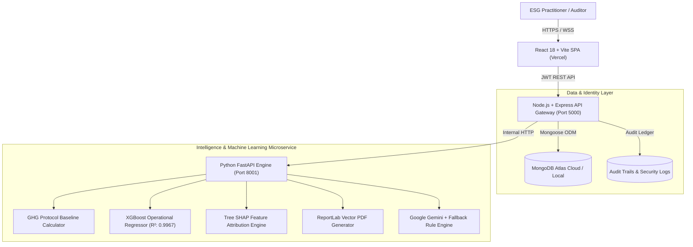

# carbonIQ

### Carbon Footprint Prediction & Explainable AI for Supply Chains

[](https://react.dev/)
[](https://www.typescriptlang.org/)
[](https://tailwindcss.com/)
[](https://nodejs.org/)
[](https://fastapi.tiangolo.com/)
[](https://xgboost.readthedocs.io/)
[](https://shap.readthedocs.io/)
[](https://www.mongodb.com/)
[](https://vercel.com/)
[](LICENSE)

---

## 📌 Executive Overview

**CarbonIQ** is an enterprise-grade, academic-standard software platform that bridges the critical transparency gap in corporate ESG accounting. Traditional carbon accounting relies exclusively on static greenhouse gas (GHG) emission factors ($E = Q \times EF$), which fail to capture operational inefficiencies such as aging freight engines, severe weather, under-capacity transport routes, or changing power grid mixes.

Conversely, black-box machine learning approaches obscure the auditable regulatory baseline required by statutory auditors under **SEBI BRSR (Business Responsibility and Sustainability Reporting)** and the **EU CSRD (Corporate Sustainability Due Diligence Directive)**.

### The CarbonIQ Dual-Engine Solution
1. **Auditable GHG Protocol Baseline**: Calculates standard emissions with 100% auditability using validated emission factors from the Central Electricity Authority (CEA), GHG Protocol, GLEC Framework, and DEFRA.
2. **Machine Learning Operational Correction (XGBoost)**: Accurately predicts real-world operational deviations driven by engine degradation, ambient weather, grid renewable percentages, and cargo load factors.
3. **Explainable AI (Tree SHAP)**: Utilizes exact Tree Explainer Shapley additive feature attributions to break down every kilogram of operational deviation into intuitive, plain-language drivers.
4. **Interactive What-If Simulation**: Enables sustainability executives to model target decarbonization levers (e.g., 30% solar rooftop switch, route optimization) and immediately visualize verified emissions reductions.
5. **Regulatory PDF Generation**: Instantly exports publication-ready sustainability reports featuring vector breakdown charts, methodology disclosures, and executive sign-off blocks.

---

## 🏗️ System Architecture

CarbonIQ is designed as a decoupled microservices architecture with a responsive single-page application (SPA), an enterprise API Gateway with role-based access control, an explainable machine learning inference engine, and a document-oriented database:



---

## ✨ Core Features & Platform Modules

### 1. 🔐 Authentication & Enterprise RBAC
- Multi-tenant tenant isolation with JWT authentication and bcrypt password salting (10 rounds).
- Granular Role-Based Access Control (**Admin**, **Analyst**, **Manager**, **User**).
- One-click demo credentials filler for friction-free academic and stakeholder evaluations.
- Complete user verification status and profile administration.

### 2. 📊 Executive Emission Intelligence Dashboard
- High-level KPI telemetry: **Total Baseline vs ML-Corrected Emissions**, Scope 1 / 2 / 3 breakdowns, and Net ML Adjustment variance.
- Monthly emission trends with historical trajectories and operational correction deltas.
- Quick-action buttons to seed demo activities, log single events, or trigger compliance PDF downloads.

### 3. 📝 Multi-Scope Activity Data Entry & CSV Ingestion
- **Single Activity Logger**: Form validation with dynamic scope auto-detection, equipment age tracking, cargo weight, and operational telemetry.
- **Batch CSV Ingestion**: Drag-and-drop parser with live data preview, row validation, error highlighting, and sample template download (`demo_activities.csv`).

### 4. 🗄️ Activity Ledger & Audit Trail
- Paginated table of all logged activities with filters by period, scope, and activity type.
- View real-time baseline vs ML-adjusted emissions for every individual activity.
- Complete audit logging tracking every mutation, calculation, and user action for regulatory compliance.

### 5. 📈 Scope-Wise Analytics & Breakdown Drilldowns
- Interactive visualizations powered by **Recharts**:
  - Scope 1: Direct emissions (fleet diesel, industrial boilers, natural gas).
  - Scope 2: Indirect purchased electricity and grid generation.
  - Scope 3: Upstream supply chain freight and raw material sourcing.
- Facility-level and supplier-level comparative emission benchmarking.

### 6. 🔮 What-If Decarbonization Simulator
- Interactively test mitigation levers:
  - Transition facility power to renewable solar/wind (Scope 2 reduction).
  - Optimize logistics routes or transition to electric fleet vehicles (Scope 1 reduction).
  - Source low-carbon raw materials or optimize freight loading (Scope 3 reduction).
- Calculates saved carbon tonnage ($t\text{ CO}_2\text{e}$) and percentage reductions.
- Save and compare mitigation scenarios for board presentations and capital expenditure planning.

### 7. 🧠 Explainable AI (XAI) & Tree SHAP Diagnostics
- Transparent feature attribution powered by the **Tree SHAP** algorithm.
- Displays waterfall contribution charts explaining *why* actual emissions differed from baseline estimates.
- Ranked drivers classified into clear operational categories (throughput, equipment degradation, weather conditions, grid purity).

### 8. 💡 AI & Rule-Based Regulatory Recommendations
- Dual-mode executive recommendation engine:
  - **Google Gemini Pro API**: Deep natural language synthesis of decarbonization strategies based on company data.
  - **Deterministic Rule Engine**: High-fidelity local fallback ensuring 100% availability even without an internet connection or external API keys.

### 9. 📄 Regulatory PDF Compliance Reporting
- One-click vector PDF generation adhering to **SEBI BRSR Core** and **EU CSRD** audit standards.
- Vector charts illustrating scope distributions, monthly variances, and SHAP top drivers.
- Formal sign-off declaration, audit timestamp, and methodology disclosures.

### 10. 🏷️ Emission Factors Governance Ledger
- Transparent repository of emission factors used in calculations.
- Supports localized grid standards (CEA India, DEFRA, US EPA, GLEC).
- Administrators can calibrate factors, set effective dates, and view uncertainty percentages.

### 11. ⚙️ ML Model Intelligence & Health Telemetry
- Real-time diagnostic telemetry of the active XGBoost model:
  - Model Architecture: `XGBoost Regressor (100 Estimators, Max Depth 4, Learning Rate 0.08)`
  - Performance Metrics: $R^2 = 0.9967$, $\text{MAE} = 470.97\text{ kg}$, $\text{RMSE} = 754.63\text{ kg}$
  - Training Corpus: 2,000 synthetic operational supply chain data records.

---

## 🚀 Quickstart & Local Installation

### Prerequisites
- **Node.js**: v18.0.0 or higher
- **Python**: v3.10 or higher
- **Git**
- **MongoDB**: MongoDB Atlas Cloud account or local MongoDB instance (Embedded in-memory MongoDB will activate automatically if no external database is detected).

---

### Step 1: Clone the Repository
```bash
git clone https://github.com/arunsakthi2802-star/carbonIQ.git
cd carbonIQ
```

---

### Step 2: Configure Environment Variables
Copy the root `.env.example` file to `.env`:
```bash
cp .env.example .env
```
Inside `.env`, verify or configure:
```env
PORT=5000
NODE_ENV=development
MONGO_URI="mongodb+srv://<username>:<password>@cluster0.vi2fwkr.mongodb.net/creator_workspace?retryWrites=true&w=majority&appName=Cluster0"
JWT_SECRET=carboniq-production-secret-token-key-2026-auth
ML_SERVICE_URL=http://127.0.0.1:8001
GEMINI_API_KEY=
CLIMATIQ_API_KEY=
```

---

### Step 3: Set Up and Run the Python ML Service
```bash
cd ml-service

# Create and activate virtual environment
python -m venv .venv

# Windows:
.\.venv\Scripts\activate
# macOS/Linux:
# source .venv/bin/activate

# Install dependencies
pip install -r requirements.txt

# Train the initial XGBoost model and verify SHAP engine
python train_model.py

# Launch FastAPI microservice (runs on http://127.0.0.1:8001)
uvicorn main:app --host 127.0.0.1 --port 8001 --reload
```
Interactive Swagger API documentation will be available at [http://localhost:8001/docs](http://localhost:8001/docs).

---

### Step 4: Set Up and Seed the Node.js API Gateway
Open a new terminal window:
```bash
cd backend-node

# Install dependencies
npm install

# Compile TypeScript
npm run build

# Seed MongoDB with demo company, verified users, factors & 6-month activities
npm run seed

# Start API Gateway server (runs on http://127.0.0.1:5000)
npm start
```

---

### Step 5: Set Up and Run the Frontend React Application
Open a third terminal window:
```bash
cd frontend

# Install dependencies
npm install

# Start Vite development server (runs on http://localhost:5173)
npm run dev
```

Visit **[http://localhost:5173](http://localhost:5173)** in your browser!

---

## 📖 How to Use the Application: Complete Walkthrough

### 1. Logging In
When opening [http://localhost:5173](http://localhost:5173), you will be greeted by the Login portal:
- Click **"Demo Admin"** to automatically populate `admin@carboniq.io` / `admin123`.
- Click **"Sign In to CarbonIQ"** to enter the workspace.

| Role | Email | Password | Permissions |
| :--- | :--- | :--- | :--- |
| **Sustainability Director (Admin)** | `admin@carboniq.io` | `admin123` | Full access, user CRUD, factor governance, audit logs |
| **ESG Lead Analyst** | `analyst@carboniq.io` | `analyst123` | Data entry, What-If simulation, PDF generation, analytics |
| **Supply Chain Operator** | `operator@carboniq.io` | `operator123` | Single & batch activity entry, history ledger |

---

### 2. Exploring the Dashboard
- Review **Total Emissions (t CO2e)**, baseline comparison, and net ML adjustments.
- Inspect the interactive **Scope Distribution** pie chart and the 6-month chronological emission trend.
- If testing a fresh account, click **"Seed Demo Activities"** to instantly load 12 operational benchmark records.

---

### 3. Adding Supply Chain Activity Data
1. Navigate to **Data Entry** in the sidebar.
2. **Single Entry**: Select an activity type (e.g., `Electricity Grid`, `Diesel Fuel`, `Road Freight`, `Raw Cotton`), specify the quantity (e.g. `120,000 kWh`), and enter operational parameters such as equipment age and facility ID.
3. Click **"Calculate & Record Activity"**.
4. The system calculates the auditable GHG Protocol baseline and simultaneously queries the XGBoost model for operational adjustment and SHAP values.
5. **Batch Ingestion**: Switch to the **Batch CSV Upload** tab, download the sample CSV template, drag and drop the CSV into the upload area, and click **"Process & Import Rows"**.

---

### 4. Running What-If Decarbonization Scenarios
1. Navigate to **What-If Simulator** in the sidebar.
2. Select an active reporting period (e.g., `2026-08`).
3. Adjust decarbonization sliders:
   - **Scope 2 (Electricity Reduction)**: Slider from `-50%` to `+50%`.
   - **Scope 1 (Diesel Fleet Optimization)**: Slider from `-50%` to `+50%`.
   - **Scope 3 (Freight & Raw Materials Optimization)**: Slider from `-50%` to `+50%`.
4. Observe the real-time simulation output:
   - Current Baseline vs Projected Total Emissions.
   - Total Carbon Abatement in Tonnes ($t\text{ CO}_2\text{e}$) and Percentage Reduction.
5. Click **"Save Mitigation Scenario"** to store the scenario for executive review.

---

### 5. Viewing Explainable AI (XAI) Diagnostics
1. Navigate to **Emission Analytics** or open the **Tree SHAP** diagnostic widget on the dashboard.
2. Inspect the **Attribution Waterfall**:
   - Understand why actual emissions were $+3.2\text{ t}$ above baseline.
   - Identify the primary drivers (e.g., vehicle fleet age, route weather disruptions, low renewable grid factor).
   - Read the plain-language diagnostic summary generated for non-technical auditors.

---

### 6. Generating Audit-Ready Compliance PDF Reports
1. Navigate to **Compliance Reports** in the sidebar.
2. Choose your target standard:
   - **SEBI BRSR Core** (Securities and Exchange Board of India sustainability format).
   - **EU CSRD** (European Corporate Sustainability Reporting Directive format).
   - **Executive ESG Briefing** (Internal leadership presentation format).
3. Select reporting period and sign-off title.
4. Click **"Generate & Download Vector PDF"**.
5. The generated PDF will be downloaded directly to your computer and permanently archived in the compliance history table.

---

### 7. Managing Users and Database Collections
1. Log in as an **Admin** user.
2. Navigate to **User Management** in the sidebar or test the REST API directly:
   - Create new team members with strict email and password validation.
   - Verify user credentials and change roles (`Admin`, `Analyst`, `Manager`, `User`).
   - Audit user activities in the immutable **Audit Ledger**.

---

## 🌐 Deploying to Vercel

CarbonIQ is pre-configured and optimized for **Vercel** deployment.

### Option A: Deploy from GitHub (Recommended)
1. Push your code to GitHub (follow the Git instructions below).
2. Go to your [Vercel Dashboard](https://vercel.com/dashboard) and click **"Add New Project"**.
3. Import your `carbonIQ` repository.
4. In the **Project Settings**:
   - **Framework Preset**: `Vite`
   - **Root Directory**: Leave blank (root is auto-configured with root [`vercel.json`](file:///c:/Users/aruns/OneDrive/Desktop/MY%20PROJECT/vercel.json)) or select `frontend`.
   - **Build Command**: `cd frontend && npm install && npm run build` (or `npm run build` if root is `frontend`).
   - **Output Directory**: `frontend/dist` (or `dist` if root is `frontend`).
5. **Environment Variables**:
   - Add `VITE_API_URL`: The public URL of your deployed backend (e.g. `https://carboniq-api.onrender.com/api`).
6. Click **Deploy**!

### SPA Routing & Clean URLs
The included [`frontend/vercel.json`](file:///c:/Users/aruns/OneDrive/Desktop/MY%20PROJECT/frontend/vercel.json) ensures all React Router routes (`/app/dashboard`, `/login`, `/app/whatif`, etc.) automatically rewrite to `index.html` with immutable caching headers for static assets:
```json
{
  "$schema": "https://openapi.vercel.sh/vercel.json",
  "framework": "vite",
  "cleanUrls": true,
  "rewrites": [
    { "source": "/(.*)", "destination": "/index.html" }
  ]
}
```

> **Note on Backend & ML Hosting**: The Node.js API Gateway and Python FastAPI ML service can be deployed for free on [Render](https://render.com), [Railway](https://railway.app), or [Fly.io](https://fly.io) using the included `Dockerfile` configurations in `backend-node/Dockerfile` and `ml-service/Dockerfile`.

---

## 📡 RESTful API Reference

### Authentication Endpoints (`/api/auth`)
| Method | Endpoint | Description | Access |
| :--- | :--- | :--- | :--- |
| `POST` | `/api/auth/register` | Register new organization & admin | Public |
| `POST` | `/api/auth/login` | Authenticate and obtain JWT token | Public |
| `GET` | `/api/auth/me` | Fetch active user profile and company info | Authenticated |

### User Management Endpoints (`/api/users`)
| Method | Endpoint | Description | Access |
| :--- | :--- | :--- | :--- |
| `POST` | `/api/users` | Create, validate, and persist new user | Admin |
| `GET` | `/api/users` | List users with pagination and search query | Admin |
| `GET` | `/api/users/:id` | Retrieve single user record by ID | Admin |
| `PUT` | `/api/users/:id` | Update profile, role, or reset password | Admin |
| `POST` | `/api/users/:id/verify` | Verify credentials and activate account | Admin |
| `DELETE` | `/api/users/:id` | Remove user from database and log audit | Admin |

### Activity Entries (`/api/activity-entries`)
| Method | Endpoint | Description | Access |
| :--- | :--- | :--- | :--- |
| `POST` | `/api/activity-entries` | Log activity; auto-triggers ML & SHAP | Authenticated |
| `GET` | `/api/activity-entries` | Get paginated list of logged activities | Authenticated |
| `POST` | `/api/activity-entries/bulk` | Ingest multiple activities via CSV | Authenticated |
| `DELETE` | `/api/activity-entries/:id` | Delete activity and recalculate totals | Authenticated |

### Dashboard & Analytics (`/api/dashboard`)
| Method | Endpoint | Description | Access |
| :--- | :--- | :--- | :--- |
| `GET` | `/api/dashboard/summary` | Get aggregated Scope 1/2/3 & ML deltas | Authenticated |
| `GET` | `/api/dashboard/trend` | Get multi-month historical trends | Authenticated |
| `POST` | `/api/dashboard/seed-demo` | Seed benchmark data for demonstrations | Authenticated |

### What-If Simulation (`/api/whatif`)
| Method | Endpoint | Description | Access |
| :--- | :--- | :--- | :--- |
| `POST` | `/api/whatif` | Calculate real-time scenario abatement | Authenticated |
| `GET` | `/api/whatif/scenarios` | List saved decarbonization scenarios | Authenticated |

### Reports & Compliance (`/api/reports`)
| Method | Endpoint | Description | Access |
| :--- | :--- | :--- | :--- |
| `POST` | `/api/reports/generate` | Generate publication-ready vector PDF | Authenticated |
| `GET` | `/api/reports` | List generated compliance reports | Authenticated |
| `GET` | `/api/reports/download/:id`| Download generated PDF report file | Authenticated |

---

## 🧪 Testing and Validation

Run the automated test suites across all layers:

```bash
# Test Node.js Backend API and User Validation Rules
cd backend-node
npm run seed

# Test ML Microservice Calculation and SHAP Engine
cd ../ml-service
pytest tests/
```

---

## 👥 Authors & Academic Attribution

- **Project Title**: CarbonIQ — Carbon Footprint Prediction & Explainable AI for Supply Chains
- **Institution**: Department of Artificial Intelligence and Data Science, AVS College of Arts & Science
- **Lead Developer & Maintainer**: Arun Sakthi ([@arunsakthi2802-star](https://github.com/arunsakthi2802-star))

---

## 📄 License

This project is licensed under the **MIT License** — see the [LICENSE](LICENSE) file for details.
